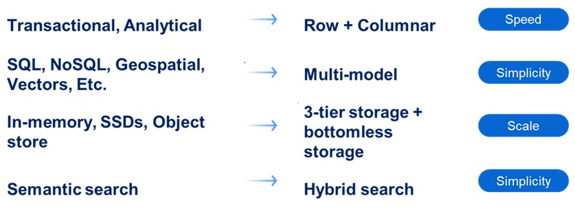
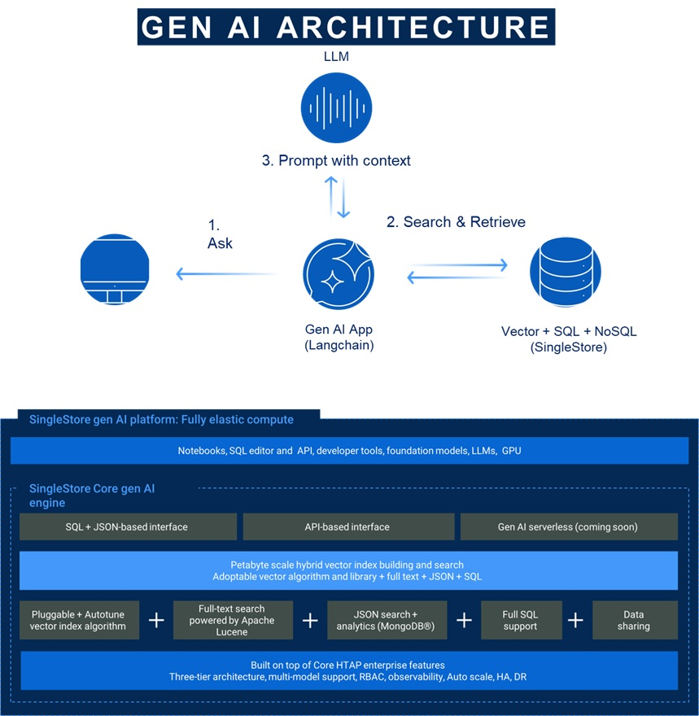
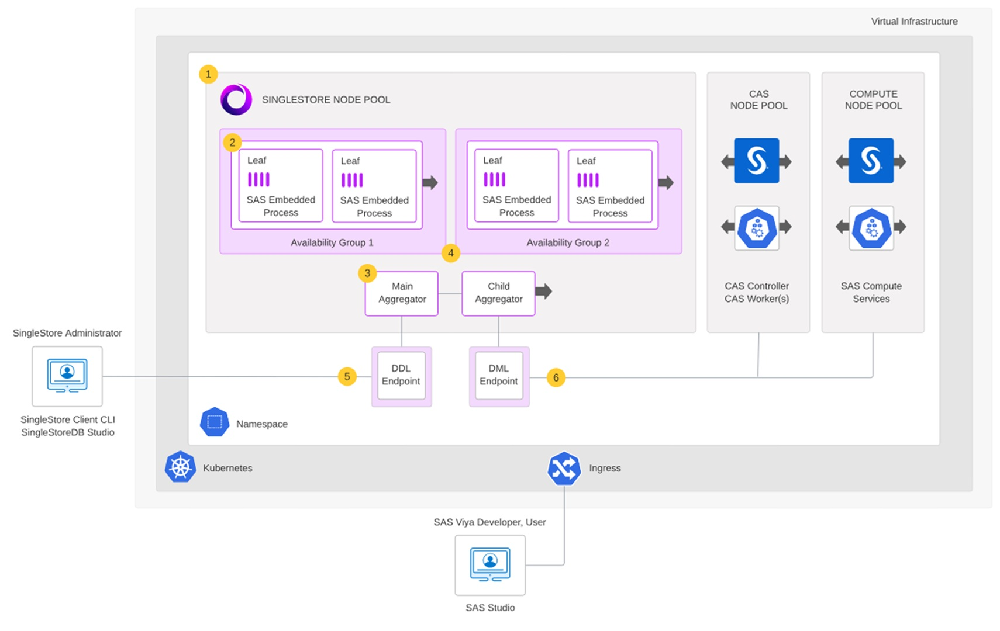

# SpeedystoreHack
Repo to hold instructions for use of Speedystore for SAS Hackathon

## Fast Analytical Queries, No More ETL Pipelines

## A Single Data Platform For Analytics & AI

### Benefits
* Use your data platform for your Gen AI apps
* One data platform for all use cases (Vector, SQL, NoSQL)
* Utilize existing features for Real-time data ingestion and efficient bulk load of vectors
* An enterprise platform with ACID transactions, High Availability, DR, Point in time recovery

## Deployment architecture

## Make Singlestore work with SAS Viya

To use Singlestore from Viya in this setup, there are a few things that needs to be configured in Singlestore; some configuration to ensure sorting is similar to SAS, setup users to access Singlestore, and databases to work with from SAS Viya. SAS Viya also need to define libname and caslib towards the database in Singlestore you want to work with.

And dont worry - we have this sorted - there is a powershell script [here](bootstrap_singlestore.ps1) you can run from this repository for the Singlestore setup, and there are also github actions you can use from [this repository](https://github.com/sas-institute-cloudops/engage-dac-speedystore-actions/actions/workflows/api-post-deploy-config.yaml) if you prefer that.

After running this script, we have Singlestore ready for use with your SAS Viya engage environment.

In here you may want to add a libname to be able to access Singlestore from Compute and a caslib to be able to access Singlestore from CAS.

Use these sas codes to be able to do that - from inside SAS Studio:

* [Compute libname](lib_Singlestore.sas)
* [Caslib](caslib_Singlestore.sas)

## Useful resources

### From Singlestore
* [Singlestore documentation site](https://docs.singlestore.com/db/v9.0/)

### From SAS
* [Deployment architecture](https://go.documentation.sas.com/doc/en/sasadmincdc/v_066/calsinglestore/n1y10xsht7ot2zn1nnmh7zefv79f.htm)
* [Community blog on enhancing performance with Aggregate](https://communities.sas.com/t5/SAS-Communities-Library/Using-SAS-with-SingleStore-Enhancing-Performance-with-Aggregate/ta-p/961443)
* [Documentation page on managing the Singlestore Cluster](https://go.documentation.sas.com/doc/en/sasadmincdc/v_066/calsinglestore/p0fql8rxnrm4onn13mb4yku1zimj.htm)
* [This repository](https://github.com/larsatsas/SpeedystoreHack)

