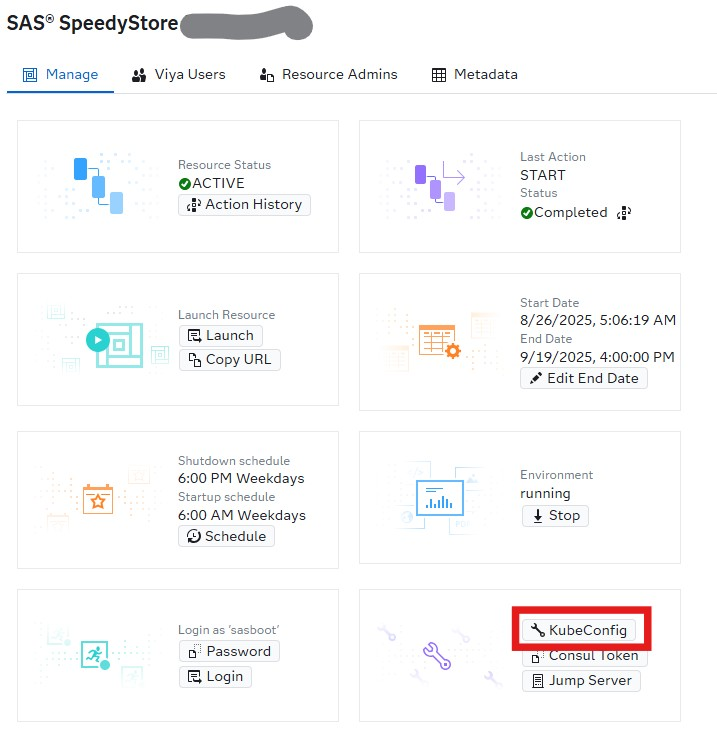

# SpeedystoreHack
Repo to hold instructions for use of Speedystore for SAS Hackathon as well as some practical information about Singlestore.

1. [Download kubeconfig](#download-kubeconfig-and-make-it-yours) and make it yours
2. [Configure Singlestore to work well with SAS Viya](#configure-singlestore-to-work-with-sas-viya) - run one of these scripts; Powershell or Linux in WSL on your laptop
3. [Run SAS Code]() to set up Compute Library and CASLib to Singlestore
4. Find IP address of Singlestore endpoint
5. Connect SQL Client to Singlestore (could be SAS Studio)

## Download kubeconfig and make it yours
First download the kubeconfig from your engage environment - see illustration below

Once it is downloaded - copy the downloaded kubeconfig file to your .kube folder under your home folder.

In WSL - do: cp --downloaded file-- $HOME/.kube/engagekube

In Powershell - do: cp --downloaded file-- $HOME\.kube\engagekube

## Configure Singlestore to work with SAS VIya

From your homefolder clone this repo: 
git clone https://github.com/larsatsas/SpeedystoreHack.git

Now that you have this available locally, you can run a script that does the configuration on the basis of those scripts.

In WSL - run this from your home folder: 
> sh SpeedystoreHack/bootstrap_singelstore.sh

In Powershell - we need to copy and paste the ps1 file for now - feel free to work with the script to make this work automatically.
Copy the content from [this repo](bootstrap_singlestore.ps1)
And paste it from your home folder in Powershell. 

## Run SAS Code to set up Compute library and Caslib

## Fast Analytical Queries, No More ETL Pipelines

## A Single Data Platform For Analytics & AI

### Benefits
* Use your data platform for your Gen AI apps
* One data platform for all use cases (Vector, SQL, NoSQL)
* Utilize existing features for Real-time data ingestion and efficient bulk load of vectors
* An enterprise platform with ACID transactions, High Availability, DR, Point in time recovery

## Deployment architecture

## Make Singlestore work with SAS Viya

To use Singlestore from Viya in this setup, there are a few things that needs to be configured in Singlestore; some configuration to ensure sorting is similar to SAS, setup users to access Singlestore, and databases to work with from SAS Viya. SAS Viya also need to define libname and caslib towards the database in Singlestore you want to work with.

And dont worry - we have this sorted - there is a powershell script [here](bootstrap_singlestore.ps1) and shell script [here](bootstrap_singelstore.sh) to run in WSL you can run from this repository for the Singlestore setup, and there are also github actions you can use from [this repository](https://github.com/sas-institute-cloudops/engage-dac-speedystore-actions/actions/workflows/api-post-deploy-config.yaml) if you prefer that.

After running this script, we have Singlestore ready for use with your SAS Viya engage environment.

In here you may want to add a libname to be able to access Singlestore from Compute and a caslib to be able to access Singlestore from CAS.

Use these sas codes to be able to do that - from inside SAS Studio:

* [Compute libname](sas_setup/lib_Singlestore.sas)
* [Caslib](sas_setup/caslib_Singlestore.sas)

## Useful resources

### From Singlestore
* [Singlestore documentation site](https://docs.singlestore.com/db/v9.0/)

### From SAS
* [Deployment architecture](https://go.documentation.sas.com/doc/en/sasadmincdc/v_066/calsinglestore/n1y10xsht7ot2zn1nnmh7zefv79f.htm)
* [Community blog on enhancing performance with Aggregate](https://communities.sas.com/t5/SAS-Communities-Library/Using-SAS-with-SingleStore-Enhancing-Performance-with-Aggregate/ta-p/961443)
* [Documentation page on managing the Singlestore Cluster](https://go.documentation.sas.com/doc/en/sasadmincdc/v_066/calsinglestore/p0fql8rxnrm4onn13mb4yku1zimj.htm)
* [This repository](https://github.com/larsatsas/SpeedystoreHack)

